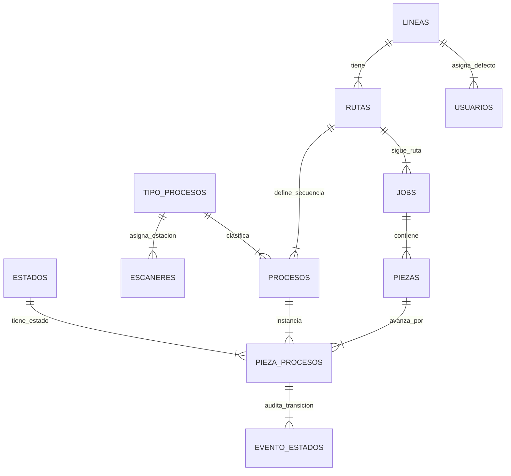

# TUUCI - Arquitectura del Sistema de Trazabilidad y Control de Producción
**Fecha de actualización:** Septiembre 2026  
**Versión:** 2.0 (Actualizada con Rutas Múltiples por Línea, Catálogos Maestros y Gestión Integral)

---

## 1. Contexto y Limitaciones del Problema

- **Origen de las órdenes:** Las órdenes de producción provienen de un ERP corporativo externo, sin acceso directo a su base de datos ni disponibilidad de APIs de integración.
- **Etiqueta física:** Cada trabajo genera en papel una etiqueta física de producción con un código de barras 1D que contiene exclusivamente el `Job ID` (ejemplo: `JOB0279087`). Los datos críticos de fabricación (cantidad total de piezas, modelo exacto, especificaciones de tela y estructura) están en texto impreso que no puede ser decodificado por un escáner de barras estándar.
- **Estrategia en Dos Fases:**
  - **Fase 1 (Estación de Corte con PC):** Emplea una cámara cenital USB de alta resolución y un motor OCR para digitalizar la orden, extraer todos los metadatos de fabricación, dar ingreso al Job y generar e imprimir las etiquetas QR únicas para cada una de las piezas del lote. Opera en **Modo LOTE**.
  - **Fase 2 (Estaciones Intermedias sin PC):** Opera mediante escáneres inalámbricos Wi-Fi con pantalla OLED y base de carga en el piso de planta. Identifican la estación fija y procesan las piezas en **Modo INDIVIDUAL** mediante escaneo directo de su código QR único.

---

## 2. Roles, Permisos y Alcance por Línea

| Rol | Línea Asociada | Visibilidad en el Tablero | Acciones y Capacidades | Filtro por Job |
| :--- | :--- | :--- | :--- | :--- |
| **ADMIN** | Ninguna (Sin filtro global) | Acceso total a todas las Líneas, todas las Rutas, todos los Jobs y todos los estados (incluidos los ocultos para Operador). | Configuración global de Catálogos (Líneas, Rutas, TipoProceso, Estados con Banderas, Escáneres), administración de Usuarios y Roles, reportes y analíticas. | Disponible |
| **SUPERVISOR** | Una Línea asignada por defecto | Visualiza por defecto únicamente los Jobs, piezas y procesos de su Línea asignada. Puede ver estados técnicos/internos marcados como no visibles para Operador. | Supervisión de piso, monitoreo de cuellos de botella y avance. Sin permisos de modificación estructural de catálogos maestros ni usuarios. | Disponible |
| **OPERADOR** | Una Línea asignada por defecto (conmutable por sesión) | Visualiza únicamente su Línea activa y exclusivamente las estaciones y estados configurados con la bandera `visible_para_operador = 1`. | En Corte: escaneo OCR de órdenes físicas y generación de etiquetas QR. En estaciones intermedias: escaneo de piezas para apertura y cierre de proceso. | Disponible |

### Aspectos Clave de Seguridad e Identidad:
- **Autenticación Corporativa (SSO):** El inicio de sesión se realiza mediante cuenta corporativa de Microsoft (Azure AD / Microsoft 365). El sistema vincula la identidad Microsoft con el Rol y la Línea asignada al usuario.
- **Conmutabilidad para Operadores:** Si un operador es reasignado temporalmente a otra línea de manufactura durante su jornada, puede cambiar su línea activa en la sesión sin alterar su configuración por defecto guardada por el Administrador.
- **Auditoría de Dispositivos:** Los escáneres inalámbricos de piso no identifican a la persona física, sino a la estación física fija. Cada evento de escaneo registra el identificador de hardware del escáner (`codigo_estacion`), garantizando trazabilidad total de dispositivos.

---

## 3. Líneas de Producto y Rutas Múltiples de Proceso (Arquitectura Opción A)

El sistema soporta las diferentes familias de producto de TUUCI:
- **Clásica**
- **Cantiléver**
- **Cabaña**
- **Mueble**
- **Otro / Personalizado**

### Concepto de Rutas de Proceso por Línea (Option A):
A diferencia de un esquema rígido donde cada línea tiene una sola secuencia fija, la arquitectura actual permite que **cada Línea de Producto posea 1 o más Rutas de Manufactura independientes** (`rutas`):
- **Ruta Estándar (Principal / Default):** Asignada automáticamente a nuevos trabajos a menos que se indique lo contrario.
- **Rutas Secundarias o Especiales:** Ejemplos: *Ruta con Maquinado Especial*, *Ruta Express*, *Ruta Marina Reforzada*.
- **Independencia de Pasos:** Cada ruta define su propia secuencia de estaciones (`procesos`) con números de orden (1, 2, 3...) sin colisionar con otras rutas de la misma línea.
- **Trazabilidad por Job:** Cada orden (`jobs`) guarda su `ruta_id`. Las piezas generadas ejecutan estrictamente las estaciones correspondientes a la ruta asignada a su Job.

---

## 4. Entidades Principales del Modelo de Datos

1. **`usuarios`:** Identidad corporativa Microsoft (SSO), nombre, email, rol (`ADMIN`, `SUPERVISOR`, `OPERADOR`) y `linea_id` asignada.
2. **`lineas`:** Familias de sombrillas y mobiliario (Clásica, Cantiléver, Cabaña, Mueble, etc.).
3. **`rutas`:** Variantes de procesos asociadas a una línea. Contiene la bandera `es_default` para identificar la ruta principal.
4. **`tipo_procesos`:** Catálogo maestro global de tipos de estación (Corte, Fabricación, Maquinado, Ensamble, QC, Packing, Done, etc.). Desacopla las estaciones físicas de las líneas de producto.
5. **`procesos`:** Estaciones pertenecientes a una ruta de proceso con su orden secuencial (`orden`) y su modo de ejecución (`modo_trabajo`: `LOTE` o `INDIVIDUAL`).
6. **`estados`:** Estados del ciclo de vida con banderas de comportamiento dinámicas.
7. **`escaneres`:** Terminales físicas Wi-Fi asignadas a un `tipo_proceso_id` con estado de activación.
8. **`jobs`:** Órdenes de fabricación nacidas en Corte. Almacenan `job_code`, `linea_id`, `ruta_id`, modelo, especificaciones crudas OCR y cantidad total de piezas.
9. **`piezas`:** Cada unidad física producida en el Job, identificada por su `codigo_qr_unico` (ejemplo: `JOB0279087-01`).
10. **`pieza_procesos`:** Registro del progreso de una pieza en cada paso de su ruta. Vincula la pieza con el proceso y el estado actual, registrando timestamps y escáneres de apertura/cierre.
11. **`evento_estados`:** Bitácora inmutable de auditoría para cada transición de estado en el sistema.

---

## 5. Catálogo de Estados y Banderas de Comportamiento

Los estados del ciclo de vida son dinámicos y están gobernados por banderas de comportamiento leídas en tiempo de ejecución por el motor de estados:

| Nombre | Orden | Visible para Operador | Permite Escaneo | Dispara Activación del Siguiente | Descripción Funcional |
| :--- | :---: | :---: | :---: | :---: | :--- |
| **INACTIVO** | 1 | No | No | No | Estado inicial de pasos futuros en la ruta. La pieza aún no ha llegado a esta estación. |
| **ESPERANDO** | 2 | Sí | Sí | No | La pieza está en la cola de la estación lista para ser procesada. Un escaneo la abre. |
| **EN PROCESO** | 3 | Sí | Sí | No | La pieza o lote está siendo trabajada. El reloj de tiempo de ciclo está corriendo. Un escaneo la cierra. |
| **TERMINADA** | 4 | Sí | No | Sí | Proceso completado. Dispara el paso del siguiente proceso de la ruta de `INACTIVO` a `ESPERANDO`. |

- **Extensibilidad sin código:** Si en el futuro se requiere un estado como `PAUSADA` o `RECHAZADA`, se añade en el catálogo de estados configurando sus banderas sin necesidad de desplegar nuevo código.
- **Acciones Rápidas:** El Panel de Administración permite alternar banderas con un clic y reordenar estados de forma atómica.

---

## 6. Flujos de Hardware y Operación

### Fase 1: Estación de Corte (Entrada Inicial al Sistema)
- **Hardware:** Cámara cenital USB (ej. IPEVO V4K-PRO) con iluminación LED + Computadora de corte + Impresora térmica de etiquetas para códigos QR.
- **Modo de Trabajo:** `LOTE`.
- **Secuencia:**
  1. El operador de Corte inicia sesión mediante SSO Microsoft.
  2. Coloca la hoja de orden física bajo la cámara cenital.
  3. El sistema captura la imagen y el módulo OCR extrae: `Job ID`, cantidad total de piezas (analizando "Carton: X Of Y"), modelo y especificaciones.
  4. Pantalla de confirmación con vista previa (3-4 segundos). Si el operador acepta:
     - Se crea el registro `jobs` con su `linea_id` y `ruta_id` (ruta por defecto o seleccionada).
     - Se crean las $N$ piezas individuales con sus códigos QR (ej. `JOB-01`, `JOB-02`).
     - Se instancian todos los pasos de la ruta: Corte inicia en `EN PROCESO`; las estaciones subsiguientes inician en `INACTIVO`.
     - La impresora emite automáticamente las $N$ etiquetas QR adhesivas.
  5. Una vez finalizado el corte del lote físico, el operador realiza un único cierre en pantalla (o escaneo de cualquier QR del lote). Al estar en modo `LOTE`, **todas las piezas del Job pasan simultáneamente a `TERMINADA`**, y la siguiente estación de la ruta se activa a `ESPERANDO` para las $N$ piezas.

### Fase 2: Estaciones Intermedias (Fabricación, Maquinado, Ensamble, Packing, etc.)
- **Hardware:** Escáneres inalámbricos Wi-Fi con pantalla OLED y base de recarga (sin computadora en estación).
- **Modo de Trabajo:** `INDIVIDUAL`.
- **Secuencia:**
  1. El operario toma una pieza física y escanea su código QR único con el terminal de la estación.
  2. El escáner envía por red local Wi-Fi: `{ codigoEstacion: "FABRICACION-01", codigoQRUnico: "JOB0279087-03" }`.
  3. El motor de estados consulta el estado de esa pieza en el proceso correspondiente a la estación:
     - **Si estaba en `ESPERANDO`:** Cambia a `EN PROCESO`, inicia temporizador, retorna a pantalla OLED: `SEND OK - abierto` con tono/bip verde.
     - **Si estaba en `EN PROCESO`:** Cambia a `TERMINADA`, calcula tiempo exacto de ciclo, activa la siguiente estación de esa pieza a `ESPERANDO`, retorna a pantalla OLED: `SEND OK - cerrado` con tono/bip verde.
     - **Si no permite escaneo (inactiva o ya terminada):** Retorna `ERROR` con tono/bip rojo sin alterar el estado.
  4. La API emite un evento WebSocket en tiempo real que refresca el tablero Kanban sin recargar la página.

### Fase 3: Estación de Cierre de Lote Configurable con Reconciliación Forense
- **Bandera de Configuración:** `procesos.es_proceso_cierre` (Booleano / Checkbox en Admin).
- **Modo de Trabajo Obligatorio en LOTE:**
  Toda estación designada como estación de cierre de lote opera obligatoriamente en **`Modo LOTE`** (`modo_trabajo = 'LOTE'`). Al asignarla o marcarla, el sistema bloquea y fuerza este modo automáticamente, ya que el cierre de lote engloba y concilia la totalidad de la orden.
- **Control Total para el Administrador:**
  En lugar de asumir a ciegas que la última estación de la ruta es siempre la de cierre, **el administrador define explícitamente con un check o botón en la ruta cuál es la Estación Oficial de Cierre de Lote** (por ejemplo: `PACKING`, `CONTROL DE CALIDAD`, o `DONE`).
- **Problema Operativo Resuelto:**
  En la estación designada para cierre de lote, el trabajo se manipula y despacha como lote completo. Si por alguna razón una pieza (ejemplo: `JOB0279087-05`) no completó una o más estaciones intermedias previas (por daño en tela, retención de calidad o extravío físico), el sistema no bloquea el despacho de las sombrillas que sí están listas, pero tampoco oculta la pieza faltante.
- **Protocolo de Reconciliación:**
  1. **Pre-Auditoría Automática (`GET /api/jobs/:id/audit-lote`):** Antes de cerrar, el sistema audita pieza por pieza contra la estación designada como `es_proceso_cierre = 1`. Si todas las piezas cumplieron el flujo, marca `isClean = true`. Si alguna pieza se quedó en estaciones anteriores, marca `isClean = false` y calcula exactamente:
     - Pieza rezagada (`codigoQRUnico`).
     - Última estación real completada.
     - Pasos que omitió (ej. `[FABRICACION, QC, PACKING]`).
  2. **Validación y Justificación de Supervisor:**
     - En cierre limpio: se confirma con un clic.
     - En cierre con rezago: la interfaz exige notas obligatorias de justificación del supervisor (ej. *"Pieza 05 dañada en corte y descartada físicamente; resto de sombrillas despachadas"*).
  3. **Ejecución Transaccional Atómica (`POST /api/jobs/:id/close-final-batch`):**
     - Piezas normales pasan a `TERMINADA`.
     - Piezas rezagadas se marcan con la bandera `piezas.cierre_excepcion = 1` y pasan a `TERMINADA` en la estación de cierre.
     - Se registra en `evento_estados` un evento forense inmutable con la `observacion`: pasos omitidos, estación de origen, usuario supervisor y motivo.
     - La orden (`jobs`) se actualiza a `COMPLETADO_CON_INCIDENCIAS` (o `COMPLETADO` si fue limpia), registrando `fecha_cierre`, `cerrado_por_usuario_id` y `notas_cierre`.
  4. **Consulta Histórica:** En cualquier momento posterior, supervisores y auditores pueden abrir la modal de auditoría de la orden y ver con precisión qué sombrilla no se cerró normalmente y el motivo registrado.

---

## 7. Puntos Resueltos respecto a la Versión Inicial

1. **Aprobación de `TipoProceso` como Catálogo Maestro:**  
   Implementado exitosamente. Los escáneres físicos ahora apuntan a `tipo_proceso_id`, permitiendo que un escáner en una estación física atienda piezas de cualquier línea o ruta.
2. **Soporte de Variantes de Ruta por Línea (Opción A):**  
   Implementado. Se introdujo la tabla `rutas`, permitiendo múltiples rutas por línea y evitando restricciones de orden rígidas.
3. **Gestión Completa en Interfaz de Administración:**  
   Se implementó el CRUD interactivo de Líneas, Rutas, Pasos de Ruta (con reordenamiento seguro en 2 fases y cambio de modo LOTE/INDIVIDUAL), Estados con banderas, Escáneres y Usuarios.
4. **Cierre de Lote Final con Reconciliación de Piezas Rezagadas:**  
   Implementado. El sistema reconoce la estación final en modo LOTE, audita piezas normales vs. rezagadas, registra excepciones con bitácora forense (`COMPLETADO_CON_INCIDENCIAS`) y permite despacho total con trazabilidad del porqué.
5. **Estación de Cierre de Lote Configurable por Ruta (`es_proceso_cierre`) en Modo LOTE:**  
   Implementado con un check/botón interactivo en el Panel de Administración de Rutas. El usuario define de forma dinámica cuál proceso específico ejecuta el cierre de lote y la reconciliación (asegurando una única estación de cierre por ruta), y el sistema exige y fija automáticamente su modo de trabajo en **`LOTE`**.
