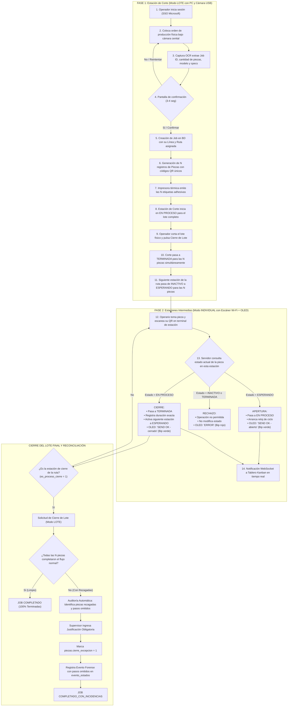

# TUUCI - Diagrama de Flujo: Ciclo de Vida de una Pieza
**Fecha de actualización:** Septiembre 2026  
**Versión:** 2.0 (De punta a punta: Entrada en Corte, Ejecución por Rutas y Finalización)

---

## 1. Alcance y Control por Rol y Línea

| Rol | Línea Asociada | Visibilidad en el Tablero | Filtro por Job |
| :--- | :--- | :--- | :---: |
| **Admin** | Ninguna (Sin filtro obligatorio) | Todas las Líneas, todas las Rutas y todos los estados (incluidos los técnicos/ocultos) | Disponible |
| **Supervisor** | Una Línea asignada | Su Línea asignada completa (incluidos estados internos no visibles para el Operador) | Disponible |
| **Operador** | Una Línea asignada (conmutable en sesión) | Su Línea activa, únicamente estaciones y estados con `visible_para_operador = 1` | Disponible |

---

## 2. Catálogo de Estados y Reglas de Transición

El motor de estados (`StateEngine`) no tiene estados fijos 'hardcoded', sino que evalúa dinámicamente las banderas configuradas en la base de datos:

| Nombre | Orden | Visible para Operador | Permite Escaneo | Dispara Activación Siguiente | Acción ante Escaneo |
| :--- | :---: | :---: | :---: | :---: | :--- |
| **INACTIVO** | 1 | No | No | No | Rechaza escaneo con error. La pieza no ha llegado a esta estación. |
| **ESPERANDO** | 2 | Sí | Sí | No | **Abre la estación:** Cambia a `EN PROCESO`, arranca cronómetro de ciclo. |
| **EN PROCESO** | 3 | Sí | Sí | No | **Cierra la estación:** Cambia a `TERMINADA`, detiene cronómetro, activa siguiente estación. |
| **TERMINADA** | 4 | Sí | No | Sí | Ya finalizado en esta estación. No permite escaneo. |

---

## 3. Diagrama de Flujo General de una Pieza (End-to-End)



---

## 4. Tabla Detallada de Eventos Paso a Paso

### FASE 1: Estación de Corte (Modo LOTE)
| Paso | Evento / Acción del Operador | Respuesta del Sistema | Impacto en Base de Datos |
| :---: | :--- | :--- | :--- |
| **1** | Operador inicia sesión con cuenta Microsoft. | Carga la Línea asignada por defecto (Clásica / Cantiléver / Cabaña / Mueble), con opción de cambiarla. | Identifica al usuario `usuarios.id`. |
| **2** | Apoya la orden física bajo la cámara cenital USB. | Iluminación cenital LED y captura de imagen en alta resolución. | Archiva imagen en `jobs.imagen_etiqueta_url`. |
| **3** | Módulo OCR procesa el documento. | Reconoce el código de barras 1D (`Job ID`), extrae cantidad de piezas desde `"Carton: X Of Y"`, modelo y especificaciones. | Almacena texto crudo en `jobs.specs_raw`. |
| **4** | Pantalla de confirmación con vista previa (3 seg). | Muestra Job ID, cantidad de piezas, modelo y Línea activa. Botones táctiles: "Sí, imprimir" o "No, repetir foto". | Si pulsa "No", no genera cambios y permite retomar la foto. |
| **5** | Operador presiona "Sí, imprimir". | Confirma la entrada de la orden al sistema de planta. | Crea fila en `jobs` asociada a `linea_id` y `ruta_id`. |
| **6** | Generación de piezas individuales. | Crea las $N$ piezas correlativas (`JOB-01`, `JOB-02`...). | Crea $N$ filas en `piezas`. |
| **7** | Instanciación de la ruta de manufactura. | Configura los pasos de la ruta: Corte inicia en `EN PROCESO`, los pasos restantes inician en `INACTIVO`. | Inserta filas en `pieza_procesos` para cada pieza y estación. |
| **8** | Impresión simultánea de etiquetas. | La impresora térmica saca las $N$ etiquetas adhesivas con código QR único para que el operador las pegue en los tubos/piezas. | Etiquetas físicas listas para colocación. |
| **9** | Finalización del corte de lote físico. | Operador pulsa "Cerrar Lote" en pantalla o escanea una etiqueta cualquiera del lote. | `pieza_procesos` para Corte pasa a `TERMINADA` para todas las piezas. |
| **10** | Activación descendente por lote. | Al pasar Corte a `TERMINADA` (bandera `dispara_activacion = 1`), la siguiente estación de la ruta pasa a `ESPERANDO` para las $N$ piezas. | Las piezas quedan listas en la cola de la estación siguiente. |

---

### FASE 2: Estaciones Intermedias (Modo INDIVIDUAL con Escáner Wi-Fi + OLED)
Este ciclo se repite en cada estación de la ruta (Fabricación, Maquinado, Ensamble, QC, Packing):

| Paso | Evento / Acción del Operario | Respuesta del Servidor | Mensaje en OLED | Tono Auditivo |
| :---: | :--- | :--- | :---: | :---: |
| **11** | Operario toma una pieza y escanea su código QR único. | El escáner envía `codigoEstacion` y `codigoQRUnico` al backend. | Procesando... | — |
| **12a** | La pieza estaba en estado `ESPERANDO` en esa estación. | **Apertura:** Pasa a `EN PROCESO`, registra `fecha_inicio`, `escaner_apertura_id` y arranca reloj de ciclo. | `SEND OK`<br>`abierto` | **Bip Verde** (Éxito) |
| **12b** | La pieza estaba en estado `EN PROCESO` en esa estación. | **Cierre:** Pasa a `TERMINADA`, registra `fecha_fin`, `escaner_cierre_id` y activa el siguiente paso de la ruta a `ESPERANDO`. | `SEND OK`<br>`cerrado` | **Bip Verde** (Éxito) |
| **12c** | La pieza está en `INACTIVO` (no ha pasado por estación previa) o ya está `TERMINADA`. | **Rechazo:** Operación inválida por secuencia o duplicidad. No modifica datos. | `ERROR`<br>`rechazado` | **Bip Rojo** (Alerta) |
| **13** | Sincronización en tiempo real. | Backend emite evento Socket.io que actualiza inmediatamente la tarjeta de la pieza en el Kanban de React. | — | — |

---

### FASE 3: Estación de Cierre y Reconciliación Forense de Lote (Configurable vía `es_proceso_cierre = 1`)
Ocurre en la estación configurada administrativamente como paso de cierre de la ruta (por defecto la última como Packing / Done, o cualquier estación designada con `es_proceso_cierre = 1`):

| Paso | Evento / Acción del Supervisor | Respuesta del Sistema | Impacto en Base de Datos |
| :---: | :--- | :--- | :--- |
| **14** | Usuario pulsa "Cerrar Lote Final" en la tarjeta o lista del Job. | Backend ejecuta pre-auditoría (`GET /api/jobs/:id/audit-lote`) comparando el historial de cada pieza contra las estaciones de la ruta. | Ninguno (consulta en solo lectura). |
| **15a** | **Caso Limpio:** Las $N$ piezas pasaron por todas las estaciones. | Modal muestra alerta verde: *"100% de piezas listas"*. Permite cierre directo con un clic. | `jobs.estado_cierre = 'COMPLETADO'`. Todas las piezas pasan a `TERMINADA`. |
| **15b** | **Caso con Incidencias:** Una o más piezas (ej. `JOBxxx-05`) se quedaron en estaciones previas. | Modal muestra alerta ámbar/roja con desglose exacto: QR de la pieza rezagada, última estación alcanzada y lista de estaciones omitidas. Exige justificación obligatoria. | Muestra tabla de incidencias al supervisor. |
| **16** | Supervisor escribe justificación (ej. *"Pieza 05 retenida por daño en tela; lote cerrado para entrega"*) y confirma. | Ejecuta transacción atómica: piezas listas pasan a `TERMINADA`; piezas rezagadas se marcan con `cierre_excepcion = 1`; se registra evento con pasos omitidos en `evento_estados.observacion`. | `jobs.estado_cierre = 'COMPLETADO_CON_INCIDENCIAS'`, `fecha_cierre = NOW()`, `cerrado_por_usuario_id`, `notas_cierre`. |
| **17** | Actualización y Auditoría Permanente. | Notificación Socket.io refresca tableros y KPIs. La orden queda rotulada con badge ámbar *"CON INCIDENCIAS"*. | Queda disponible botón "Auditoría" para inspección forense en cualquier momento. |

---

## 5. Variantes de Ruta por Línea de Producto (Arquitectura Opción A)

Cada pieza sigue la ruta asignada a su respectivo Job:
1. Si un Job de la línea **Clásica** usa la **Ruta Estándar**:
   `Corte` $\to$ `Fabricación` $\to$ `Packing` $\to$ `Done`
2. Si un Job de la línea **Clásica** usa la **Ruta con Maquinado**:
   `Corte` $\to$ `Fabricación` $\to$ `Maquinado` $\to$ `Packing` $\to$ `Done`

El motor de avance calcula dinámicamente la estación siguiente mediante la consulta:
```sql
SELECT id FROM procesos 
WHERE ruta_id = ? AND orden > ? 
ORDER BY orden ASC LIMIT 1;
```
Esto asegura que las piezas transiten exclusivamente por las estaciones definidas para su ruta, sin riesgo de desviaciones accidentales.

---

## 6. Auditoría y Trazabilidad Transversal

En cada escaneo o cambio de estado, el sistema registra una entrada inmutable en la tabla `evento_estados`:
- `pieza_proceso_id`: Registro de la pieza en la estación específica.
- `estado_anterior_id`: Estado previo antes del escaneo.
- `estado_nuevo_id`: Estado alcanzado (`EN PROCESO` o `TERMINADA`).
- `escaner_id`: Identificador del terminal físico Wi-Fi que capturó el código (en Fase 2).
- `usuario_id`: Identificador del operador con sesión Microsoft (en Fase 1 y Fase 3).
- `observacion`: Registro explícito de excepciones, pasos omitidos por cierre forzado o notas técnicas.
- `timestamp`: Marca de tiempo precisa en formato ISO 8601 UTC.
