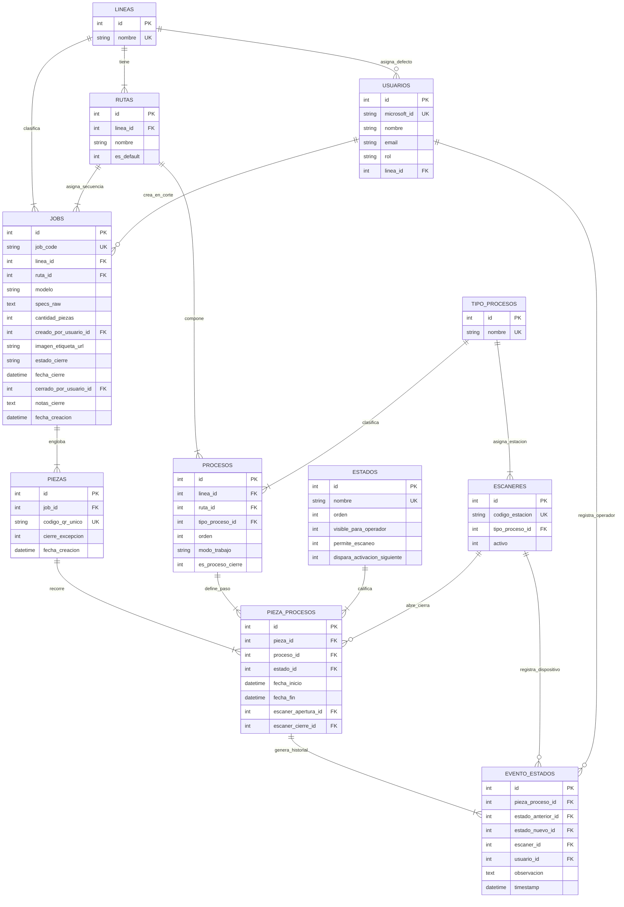

# TUUCI - Diagrama Entidad-Relación y Diccionario de Base de Datos
**Fecha de actualización:** Septiembre 2026  
**Versión:** 2.0 (Modelo Relacional con Soporte Multi-Ruta por Línea, Catálogos Maestros y Auditoría)

---

## 1. Resumen del Modelo de Datos

El sistema utiliza una base de datos relacional estructurada para garantizar integridad referencial estricta, alta velocidad de consulta y aislamiento entre variantes de procesos de manufactura.

### Innovaciones Clave del Modelo v2.0:
1. **Catálogo Maestro `tipo_procesos` (Global):** Desacopla el concepto universal de estación (Corte, Fabricación, Maquinado, etc.) de las líneas específicas, permitiendo que un mismo dispositivo escáner físico atienda piezas de cualquier línea.
2. **Multi-Rutas por Línea (`rutas`):** Cada línea de producto puede tener múltiples variantes de ruta de producción (`lineas` $1 \to N$ `rutas`), cada una con su propia secuencia independiente de estaciones (`procesos`).
3. **Restricción Unívoca por Ruta:** La unicidad de posición y de estación se aplica a nivel de ruta:
   - `UNIQUE(ruta_id, orden)`: No pueden existir dos estaciones en la misma posición de una ruta.
   - `UNIQUE(ruta_id, tipo_proceso_id)`: No se repite la misma estación dentro de una misma ruta.
4. **Catálogo de Estados con Banderas Dinámicas:** Banderas booleanas leídas por el motor genérico sin necesidad de código estático.

---

## 2. Diagrama Entidad-Relación (Mermaid)

---

## 3. Diccionario Detallado de Tablas

### 1. `usuarios`
Gestiona los operadores, supervisores y administradores autenticados mediante SSO Microsoft.
| Campo | Tipo | Restricciones | Descripción |
| :--- | :--- | :--- | :--- |
| `id` | INTEGER | PRIMARY KEY AUTOINCREMENT | Identificador interno. |
| `microsoft_id` | TEXT | NOT NULL, UNIQUE | Identificador único del usuario en Microsoft Azure AD. |
| `nombre` | TEXT | NOT NULL | Nombre y apellido del colaborador. |
| `email` | TEXT | NOT NULL | Correo electrónico corporativo. |
| `rol` | TEXT | NOT NULL, CHECK(`rol` IN ('ADMIN','SUPERVISOR','OPERADOR')) | Rol del usuario en planta. |
| `linea_id` | INTEGER | NULL, REFERENCES `lineas(id)` ON DELETE SET NULL | Línea asignada por defecto (Nulo para Admin). |

---

### 2. `lineas`
Catálogo de líneas de producto principales de TUUCI.
| Campo | Tipo | Restricciones | Descripción |
| :--- | :--- | :--- | :--- |
| `id` | INTEGER | PRIMARY KEY AUTOINCREMENT | Identificador de línea. |
| `nombre` | TEXT | NOT NULL, UNIQUE | Nombre de la línea (ej. Clásica, Cantiléver, Cabaña, Mueble). |

---

### 3. `rutas`
Variantes de rutas de manufactura asociadas a una línea de producto (Arquitectura Opción A).
| Campo | Tipo | Restricciones | Descripción |
| :--- | :--- | :--- | :--- |
| `id` | INTEGER | PRIMARY KEY AUTOINCREMENT | Identificador de ruta. |
| `linea_id` | INTEGER | NOT NULL, REFERENCES `lineas(id)` ON DELETE CASCADE | Línea a la que pertenece esta ruta. |
| `nombre` | TEXT | NOT NULL | Nombre descriptivo (ej. "Ruta Estándar", "Ruta con Maquinado"). |
| `es_default` | INTEGER | NOT NULL DEFAULT 0, CHECK(`es_default` IN (0, 1)) | 1 si es la ruta por defecto al crear trabajos de esta línea. |
| — | — | **UNIQUE(`linea_id`, `nombre`)** | Evita nombres de ruta duplicados dentro de la misma línea. |

---

### 4. `tipo_procesos`
Catálogo maestro universal de estaciones/fases de manufactura.
| Campo | Tipo | Restricciones | Descripción |
| :--- | :--- | :--- | :--- |
| `id` | INTEGER | PRIMARY KEY AUTOINCREMENT | Identificador de tipo de proceso. |
| `nombre` | TEXT | NOT NULL, UNIQUE | Nombre en mayúsculas (CORTE, FABRICACION, MAQUINADO, PACKING, DONE, etc.). |

---

### 5. `procesos`
Pasos o estaciones configuradas dentro de una ruta de proceso específica.
| Campo | Tipo | Restricciones | Descripción |
| :--- | :--- | :--- | :--- |
| `id` | INTEGER | PRIMARY KEY AUTOINCREMENT | Identificador del paso de proceso. |
| `linea_id` | INTEGER | NOT NULL, REFERENCES `lineas(id)` ON DELETE CASCADE | Línea a la que corresponde. |
| `ruta_id` | INTEGER | NOT NULL, REFERENCES `rutas(id)` ON DELETE CASCADE | Ruta específica a la que pertenece este paso. |
| `tipo_proceso_id` | INTEGER | NOT NULL, REFERENCES `tipo_procesos(id)` ON DELETE RESTRICT | Tipo maestro de proceso de este paso. |
| `orden` | INTEGER | NOT NULL | Posición secuencial en la ruta (1, 2, 3...). |
| `modo_trabajo` | TEXT | NOT NULL, CHECK(`modo_trabajo` IN ('LOTE','INDIVIDUAL')) | `LOTE` para trabajos en bloque / cierre de orden; `INDIVIDUAL` para escaneo pieza por pieza. |
| `es_proceso_cierre` | INTEGER | NOT NULL DEFAULT 0, CHECK(`es_proceso_cierre` IN (0, 1)) | Flag booleano que designa este paso como la estación oficial de cierre y conciliación de lote de la ruta (1 = Activo, 0 = Inactivo). Al activarse, su `modo_trabajo` opera obligatoriamente en `LOTE`. |
| — | — | **UNIQUE(`ruta_id`, `orden`)** | Garantiza secuencia única sin posiciones duplicadas en la ruta. |
| — | — | **UNIQUE(`ruta_id`, `tipo_proceso_id`)** | Una misma estación no puede repetirse dentro de la misma ruta. |

---

### 6. `estados`
Catálogo de estados dinámicos del ciclo de vida con banderas de control.
| Campo | Tipo | Restricciones | Descripción |
| :--- | :--- | :--- | :--- |
| `id` | INTEGER | PRIMARY KEY AUTOINCREMENT | Identificador del estado. |
| `nombre` | TEXT | NOT NULL, UNIQUE | Nombre del estado (INACTIVO, ESPERANDO, EN PROCESO, TERMINADA). |
| `orden` | INTEGER | NOT NULL | Orden de visualización / prioridad. |
| `visible_para_operador` | INTEGER | NOT NULL DEFAULT 1 | 1 si el operador lo visualiza en su interfaz; 0 para estados internos. |
| `permite_escaneo` | INTEGER | NOT NULL DEFAULT 1 | 1 si un escaneo es aceptado en este estado (para abrir o cerrar). |
| `dispara_activacion_siguiente` | INTEGER | NOT NULL DEFAULT 0 | 1 si al alcanzar este estado se activa el siguiente paso de la ruta. |

---

### 7. `escaneres`
Terminales físicas Wi-Fi en planta asignadas a una estación.
| Campo | Tipo | Restricciones | Descripción |
| :--- | :--- | :--- | :--- |
| `id` | INTEGER | PRIMARY KEY AUTOINCREMENT | Identificador del escáner. |
| `codigo_estacion` | TEXT | NOT NULL, UNIQUE | Identificador físico del escáner (ej. "FABRICACION-01", "PACKING-01"). |
| `tipo_proceso_id` | INTEGER | NOT NULL, REFERENCES `tipo_procesos(id)` ON DELETE RESTRICT | Tipo maestro de estación que atiende este escáner. |
| `activo` | INTEGER | NOT NULL DEFAULT 1 | 1 si el escáner está en servicio; 0 si está deshabilitado. |

---

### 8. `jobs`
Órdenes de producción creadas a partir del papel físico en Corte.
| Campo | Tipo | Restricciones | Descripción |
| :--- | :--- | :--- | :--- |
| `id` | INTEGER | PRIMARY KEY AUTOINCREMENT | Identificador interno del trabajo. |
| `job_code` | TEXT | NOT NULL, UNIQUE | Código leído del código de barras 1D (ej. "JOB0279087"). |
| `linea_id` | INTEGER | NOT NULL, REFERENCES `lineas(id)` ON DELETE RESTRICT | Línea de producto del trabajo. |
| `ruta_id` | INTEGER | NULL, REFERENCES `rutas(id)` ON DELETE SET NULL | Ruta específica asignada a este trabajo. |
| `modelo` | TEXT | NOT NULL | Nombre comercial del modelo extraído por OCR. |
| `specs_raw` | TEXT | NULL | Texto crudo completo extraído por OCR para auditoría. |
| `cantidad_piezas` | INTEGER | NOT NULL | Cantidad total de piezas del trabajo (de "Carton: X Of Y"). |
| `creado_por_usuario_id` | INTEGER | NULL, REFERENCES `usuarios(id)` ON DELETE SET NULL | Usuario operador de Corte que generó la orden. |
| `imagen_etiqueta_url` | TEXT | NULL | Ruta a la fotografía original capturada por la cámara cenital. |
| `estado_cierre` | TEXT | NOT NULL DEFAULT 'EN_PROCESO' CHECK IN ('EN_PROCESO', 'COMPLETADO', 'COMPLETADO_CON_INCIDENCIAS') | Estatus general de cierre del lote de producción. |
| `fecha_cierre` | DATETIME | NULL | Timestamp en que se cerró el lote final. |
| `cerrado_por_usuario_id` | INTEGER | NULL, REFERENCES `usuarios(id)` ON DELETE SET NULL | Usuario supervisor que autorizó el cierre del lote. |
| `notas_cierre` | TEXT | NULL | Justificación u observaciones del supervisor al cerrar el lote. |
| `fecha_creacion` | DATETIME | DEFAULT CURRENT_TIMESTAMP | Fecha y hora de creación de la orden. |

---

### 9. `piezas`
Unidades físicas individuales producidas dentro de un Job.
| Campo | Tipo | Restricciones | Descripción |
| :--- | :--- | :--- | :--- |
| `id` | INTEGER | PRIMARY KEY AUTOINCREMENT | Identificador interno de la pieza. |
| `job_id` | INTEGER | NOT NULL, REFERENCES `jobs(id)` ON DELETE CASCADE | Trabajo al que pertenece. |
| `codigo_qr_unico` | TEXT | NOT NULL, UNIQUE | Código único impreso en la etiqueta QR (ej. "JOB0279087-01"). |
| `cierre_excepcion` | INTEGER | NOT NULL DEFAULT 0 | 1 si la pieza fue cerrada forzosamente por omisión de estaciones; 0 si completó el flujo normal. |
| `fecha_creacion` | DATETIME | DEFAULT CURRENT_TIMESTAMP | Marca de tiempo de registro. |

---

### 10. `pieza_procesos` (Núcleo de Seguimiento Operativo)
Registra el progreso de cada pieza en cada una de las estaciones de su ruta.
| Campo | Tipo | Restricciones | Descripción |
| :--- | :--- | :--- | :--- |
| `id` | INTEGER | PRIMARY KEY AUTOINCREMENT | Identificador del registro. |
| `pieza_id` | INTEGER | NOT NULL, REFERENCES `piezas(id)` ON DELETE CASCADE | Pieza en seguimiento. |
| `proceso_id` | INTEGER | NOT NULL, REFERENCES `procesos(id)` ON DELETE CASCADE | Paso específico de la ruta. |
| `estado_id` | INTEGER | NOT NULL, REFERENCES `estados(id)` ON DELETE RESTRICT | Estado actual (`INACTIVO`, `ESPERANDO`, `EN PROCESO`, `TERMINADA`). |
| `fecha_inicio` | DATETIME | NULL | Timestamp de apertura de la estación. |
| `fecha_fin` | DATETIME | NULL | Timestamp de cierre de la estación. |
| `escaner_apertura_id` | INTEGER | NULL, REFERENCES `escaneres(id)` ON DELETE SET NULL | Dispositivo físico que realizó la apertura. |
| `escaner_cierre_id` | INTEGER | NULL, REFERENCES `escaneres(id)` ON DELETE SET NULL | Dispositivo físico que realizó el cierre. |
| — | — | **UNIQUE(`pieza_id`, `proceso_id`)** | Cada pieza solo tiene un registro por cada estación de su ruta. |

---

### 11. `evento_estados` (Bitácora Inmutable de Auditoría)
Historial completo de todas las transiciones de estado ocurridas en planta.
| Campo | Tipo | Restricciones | Descripción |
| :--- | :--- | :--- | :--- |
| `id` | INTEGER | PRIMARY KEY AUTOINCREMENT | Identificador del evento. |
| `pieza_proceso_id` | INTEGER | NOT NULL, REFERENCES `pieza_procesos(id)` ON DELETE CASCADE | Registro de proceso afectado. |
| `estado_anterior_id` | INTEGER | NULL, REFERENCES `estados(id)` ON DELETE SET NULL | Estado previo (nulo en creación). |
| `estado_nuevo_id` | INTEGER | NOT NULL, REFERENCES `estados(id)` ON DELETE RESTRICT | Estado resultante tras la acción. |
| `escaner_id` | INTEGER | NULL, REFERENCES `escaneres(id)` ON DELETE SET NULL | Terminal físico Wi-Fi emisor (en Fase 2). |
| `usuario_id` | INTEGER | NULL, REFERENCES `usuarios(id)` ON DELETE SET NULL | Operador o supervisor autenticado (en Fase 1 y Fase 3). |
| `observacion` | TEXT | NULL | Detalle forense de pasos omitidos, motivo de cierre forzado o incidencias. |
| `timestamp` | DATETIME | DEFAULT CURRENT_TIMESTAMP | Fecha y hora exacta de la transición. |

---

## 4. Tabla de Cardinalidades

| Entidad Origen | Relación | Entidad Destino | Descripción |
| :--- | :---: | :--- | :--- |
| `lineas` | **1 : N** | `rutas` | Una línea tiene una o más variantes de ruta de proceso. |
| `rutas` | **1 : N** | `procesos` | Una ruta define múltiples pasos ordenados secuencialmente. |
| `tipo_procesos` | **1 : N** | `procesos` | Un tipo maestro de estación es referenciado por múltiples pasos de ruta. |
| `tipo_procesos` | **1 : N** | `escaneres` | Un tipo de estación puede tener uno o varios escáneres físicos de piso. |
| `lineas` | **1 : N** | `jobs` | Una línea engloba múltiples órdenes de trabajo. |
| `rutas` | **1 : N** | `jobs` | Una ruta específica es asignada a una orden de trabajo. |
| `jobs` | **1 : N** | `piezas` | Un trabajo contiene $N$ piezas correlativas. |
| `piezas` | **1 : N** | `pieza_procesos` | Una pieza recorre cada una de las estaciones de su ruta. |
| `procesos` | **1 : N** | `pieza_procesos` | Un proceso de ruta registra a cada pieza que transita por él. |
| `estados` | **1 : N** | `pieza_procesos` | Un estado califica el momento actual de múltiples piezas. |
| `pieza_procesos`| **1 : N** | `evento_estados` | Un paso de pieza genera múltiples eventos de auditoría (apertura, cierre, etc.). |
| `usuarios` | **1 : N** | `jobs` | Un usuario de Corte da ingreso a múltiples órdenes de trabajo. |
| `lineas` | **1 : N** | `usuarios` | Una línea es asignada como ámbito predeterminado a varios colaboradores. |
